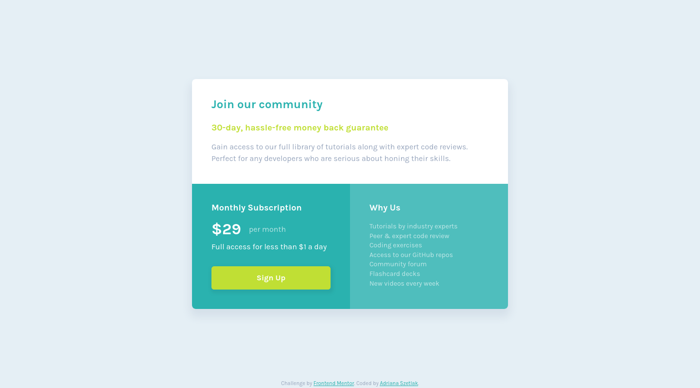

# Frontend Mentor - Single price grid component solution

This is a solution to the [Single price grid component challenge on Frontend Mentor](https://www.frontendmentor.io/challenges/single-price-grid-component-5ce41129d0ff452fec5abbbc).

## Table of contents

- [Overview](#overview)
  - [The challenge](#the-challenge)
  - [Screenshot](#screenshot)
  - [Links](#links)
- [My process](#my-process)
  - [Built with](#built-with)
  - [Useful resources](#useful-resources)
- [Author](#author)

## Overview

### The challenge

The goal:

- Make the layout for mobile nd desktop responsive states
- See a hover state on desktop for the Sign Up call-to-action

### Screenshot

### Links

- Solution URL: [GitHub Repository](https://github.com/AdrianaMagdalena/single-price-component)
- Live Site URL: [Live URL](https://adrianamagdalena.github.io/single-price-component/)

## My process

### Built with

- Semantic HTML5 markup
- CSS custom properties
- Flexbox
- CSS Grid
- Mobile-first workflow
- CSS variables

### Useful resources

- [Josh's CSS Reset](https://www.joshwcomeau.com/css/custom-css-reset/) - My go-to CSS Reset template, to make work with CSS simpler and faster

## Author

- Portfolio (not yet finished as per June 25th 2023) - [Adriana Szetlak - Portfolio](https://adrianamagdalena.github.io/portfolio/)
- GitHub - [Adriana Szetlak](https://github.com/AdrianaMagdalena)
- Frontend Mentor - [@AdrianaMagdalena](https://www.frontendmentor.io/profile/AdrianaMagdalena)
